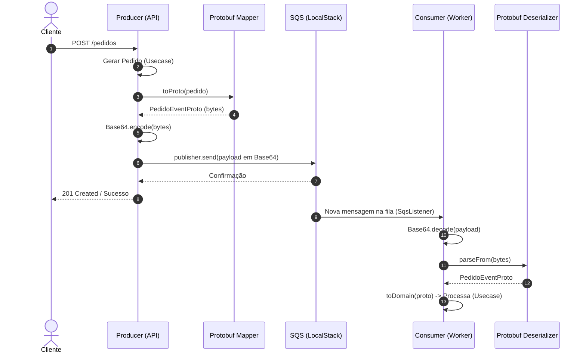

# Documentação da PoC: Serialização de Mensagens para SQS com Protobuf

Esta documentação detalha a arquitetura e a implementação do projeto **poc-serializable-sqs**. O objetivo central deste projeto é explorar e demonstrar a viabilidade e a eficiência da serialização de mensagens utilizando **Protocol Buffers (Protobuf)**, codificadas em Base64, para comunicação assíncrona entre microsserviços via **Amazon SQS** (emulado localmente com LocalStack).

---

## 🏗 Arquitetura e Fluxo de Dados

A arquitetura do projeto segue um modelo clássico de mensageria, focado na separação de responsabilidades e utilizando Clean Architecture / Hexagonal Architecture nas aplicações Java Spring Boot.

### Diagrama de Fluxo (Mermaid)

O fluxo completo se resume em:
1. O **Producer** recebe uma requisição HTTP, transforma a entidade do domínio (`Pedido`) em um formato Protobuf compilado (`PedidoEventProto`).
2. O binário gerado pelo Protobuf é codificado em **Base64** para garantir que os dados trafeguem sem perdas como texto simples aceito pelo SQS.
3. A mensagem codificada é enviada ao **SQS** que está rodando em um contêiner Docker (LocalStack).
4. O **Consumer** é acionado via anotação `@SqsListener` quando a mensagem chega.
5. O Consumer decodifica de Base64 para um array de bytes, desserializa de Protobuf de volta para objeto Java e o envia para o caso de uso (`ReceberPedidoUsecase`) ser processado em uma nova Thread (`TaskExecutor`).

---

## 📂 Estrutura de Diretórios

O projeto está modularizado em três diretórios principais:

### 1. `producer`
Este diretório contém a aplicação responsável por gerar o pedido e enviá-lo ao SQS. É uma aplicação Spring Boot.
- **`infrastructure/adapters/NotificadorAdapter.java`**: O "Adapter" da arquitetura hexagonal. Implementa a interface `NotificarPort`. É aqui que a mágica da serialização acontece:
  - O objeto de domínio é convertido para `PedidoEventProto`.
  - É chamado `toByteArray()` na classe gerada pelo Protobuf.
  - O array binário é envelopado em Base64 através do `Base64.getEncoder().encodeToString()`.
  - Envio feito utilizando `SqsTemplate` do `awspring.cloud`.
- **`src/main/proto/pedido.proto`**: Contém o contrato (schema) dos dados trafegados. Define a estrutura da mensagem com os campos `pedido_id`, `valor` e `status`.

### 2. `consumer`
Este diretório contém a aplicação (Worker) que escuta a fila SQS. Também utiliza Spring Boot e possui arquitetura similar ao producer.
- **`infra/listeners/PedidoListener.java`**: Classe orquestradora da leitura da fila.
  - Utiliza a anotação `@SqsListener` para escutar a fila do LocalStack.
  - Executa a tarefa de forma assíncrona utilizando `taskExecutor.execute(...)`.
  - Decodifica a String Base64 vinda do SQS para um array de bytes (`Base64.getDecoder().decode(mensagem)`).
  - Desserializa utilizando `PedidoEventProto.parseFrom(bytes)`.
  - Mapeia o objeto DTO do Protobuf para o modelo rico do Domínio (`Pedido`) e dispara o caso de uso (`ReceberPedidoUsecase`).
- Assim como no producer, também conta com o arquivo `.proto` (ou gera as classes de forma correspondente).

### 3. `docker`
Responsável por simular o ambiente cloud (AWS) de forma local.
- **`compose.yml`**: Define o container do **LocalStack** (`localstack/localstack:4.14.0`) mapeado na porta `4566`. É configurado para prover especificamente o serviço `sqs`.
- **`localstack-init`**: Diretório mapeado como volume no container para `/etc/localstack/init/ready.d`. Contém scripts de inicialização (como o `init-sqs.sh`) que são executados automaticamente quando o LocalStack fica pronto, criando a fila previamente para as aplicações Producer/Consumer poderem interagir desde a inicialização, sem a necessidade de comandos manuais no AWS CLI.

---

## 🚀 Vantagens desta Abordagem

1. **Performance e Tamanho de Payload**: Protobuf gera binários consideravelmente menores e serializa/desserializa muito mais rápido que o tradicional JSON (Jackson/Gson).
2. **Contrato Forte (Schema)**: O arquivo `.proto` atua como contrato forte, garantindo que o Producer e Consumer estejam sempre alinhados quanto ao formato da mensagem.
3. **Escalabilidade**: A abstração assíncrona via `TaskExecutor` no consumer (no `PedidoListener`) evita bloqueios na thread principal do listener, permitindo alto poder de concorrência ao esvaziar a fila.
4. **Isolamento e Compatibilidade**: O uso de Base64 garante que a payload Protobuf trafegue de forma segura em sistemas que esperam strings legíveis, como a API HTTP do AWS SQS.
